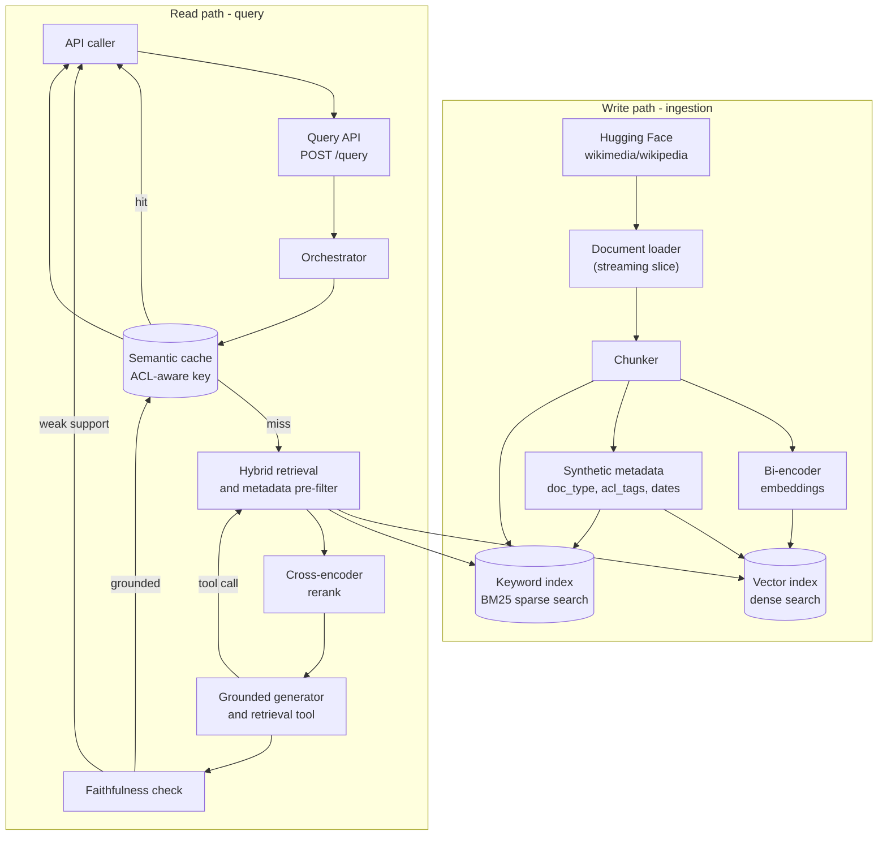
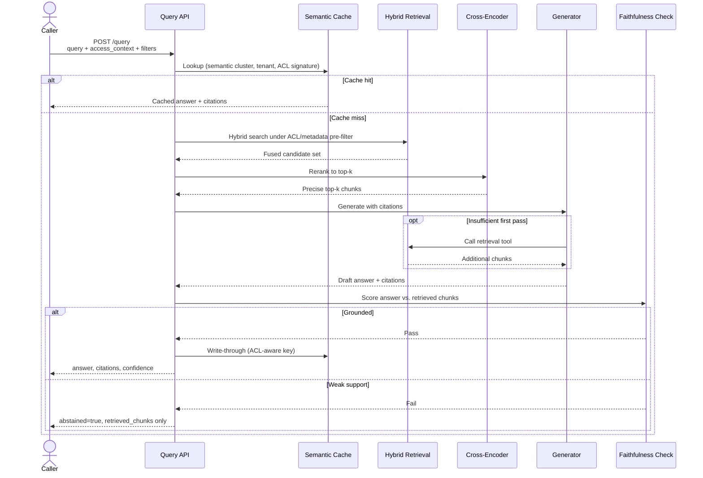
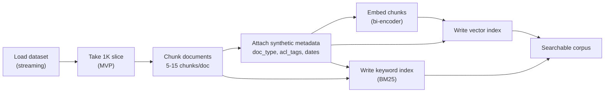
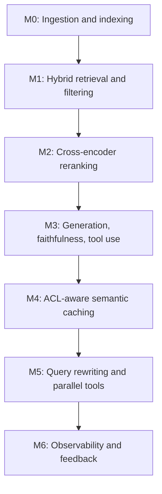
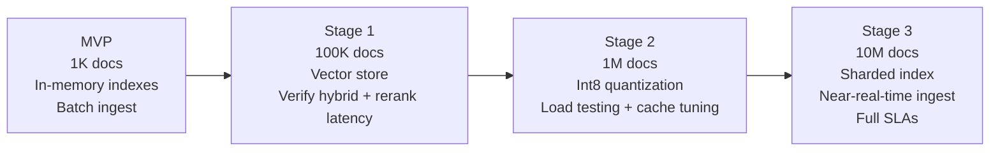
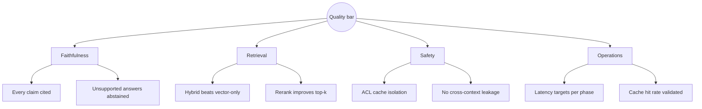

# Grounded RAG over Wikipedia

An internal **Retrieval Augmented Generation (RAG)** service that answers natural-language questions over a document corpus with **grounded citations**, **confidence scores**, and an explicit **abstain** path when evidence is insufficient. Callers interact through a single API — no UI.

The MVP indexes **1,000 English Wikipedia articles** and proves the full read path: hybrid retrieval, cross-encoder reranking, grounded generation, faithfulness checking, and ACL-aware semantic caching. The architecture is designed to scale toward **10M documents** by swapping infrastructure tiers, not rewriting components.

> See [PRD.md](./PRD.md) for the full product requirements, milestones, and scale roadmap.

---

## Table of contents

- [Why this exists](#why-this-exists)
- [Architecture](#architecture)
- [Query flow](#query-flow)
- [Ingestion flow](#ingestion-flow)
- [Dataset](#dataset)
- [API](#api)
- [Milestones](#milestones)
- [Scale roadmap](#scale-roadmap)
- [Success metrics](#success-metrics)
- [License and attribution](#license-and-attribution)

---

## Why this exists

Internal teams need trustworthy Q&A over a shared document corpus. Raw LLMs hallucinate. Plain vector search returns passages but no synthesized answer. Neither enforces access boundaries.

This service:

- Retrieves the right passages with **hybrid search** (dense + sparse) and **cross-encoder reranking**
- Generates answers **strictly grounded** in retrieved chunks, with inline citations
- **Abstains** when support is weak — the failure mode is *"I do not have enough to answer,"* not fabrication
- Respects **access context** via metadata pre-filtering and ACL-aware caching

---

## Architecture

High-level component view of the two main paths: **write** (ingestion) and **read** (query).



---

## Query flow

End-to-end path for a single query, including cache, retrieval, generation, and abstention.



---

## Ingestion flow

Batch ingestion for the MVP. At scale this becomes a change-driven pipeline with cheap metadata-only updates vs. expensive re-embed paths.



---

## Dataset

| Property | Detail |
|----------|--------|
| Source | [`wikimedia/wikipedia`](https://huggingface.co/datasets/wikimedia/wikipedia) on Hugging Face (English split) |
| MVP size | 1,000 articles (deterministic slice) |
| Scale path | Same loader, remove cap, stream in batches |
| License | [CC BY-SA 4.0](https://creativecommons.org/licenses/by-sa/4.0/) — attribution required |
| Fields | `id`, `url`, `title`, `text` |

**Synthetic metadata** (deterministic, assigned at ingestion):

- `doc_type` — derived from article characteristics (e.g. length bands)
- `acl_tags` — hashed doc ID into synthetic access groups
- `created_at` / `updated_at` — for date-range filtering and freshness logic

```python
from datasets import load_dataset

ds = load_dataset("wikimedia/wikipedia", "20231101.en", split="train", streaming=True)
mvp_docs = []
for i, row in enumerate(ds):
    if i >= 1000:
        break
    mvp_docs.append(row)  # id, url, title, text
```

---

## API

Single primary endpoint. Full contract details are in [PRD.md §8](./PRD.md#8-api-contract-mvp).

### Request

```http
POST /query
```

```json
{
  "query": "Who developed the theory of relativity?",
  "access_context": { "groups": ["group_a", "group_b"] },
  "filters": { "doc_type": "optional", "date_range": "optional" },
  "options": { "top_k": 5, "allow_generation": true }
}
```

### Response

```json
{
  "answer": "Albert Einstein developed the theory of relativity...",
  "abstained": false,
  "confidence": 0.92,
  "citations": [
    { "chunk_id": "...", "doc_id": "...", "title": "Albert Einstein", "url": "..." }
  ],
  "retrieved_chunks": [
    { "chunk_id": "...", "text": "...", "score": 0.87 }
  ]
}
```

When `abstained` is `true`, `answer` is `null`, `confidence` reflects weak support, and `retrieved_chunks` still returns the closest matches.

---

## Milestones

Build is organized into six MVP milestones plus Phase 2 extensions.



| Milestone | Scope | Exit criteria |
|-----------|-------|---------------|
| **M0** | Batch ingest 1K docs, chunk, embed, index | Every doc searchable in vector + keyword indexes |
| **M1** | Hybrid retrieval + metadata/ACL pre-filter | Hybrid recall beats vector-only on labeled set |
| **M2** | Cross-encoder reranking | Rerank improves top-k precision vs. fusion alone |
| **M3** | Grounded generation, citations, faithfulness, abstain, retrieval tool | Every response grounded with citations or explicit abstention |
| **M4** | ACL-aware semantic cache | Repeat queries hit cache; cross-context leakage test passes |
| **M5** | Query rewriting, parallel tool calls | Multi-hop queries work; partial tool failure degrades gracefully |
| **M6** | Tracing, feedback capture | Any request traceable end-to-end |

---

## Scale roadmap

Same component boundaries from MVP to 10M — scaling is staged infrastructure changes.



| Stage | Corpus | What changes | What stays the same |
|-------|--------|--------------|---------------------|
| MVP | 1K | In-memory / single-node indexes; batch ingest | All component interfaces |
| Stage 1 | 100K | Move to a real vector store | Read path logic, API contract |
| Stage 2 | 1M | Int8 quantization; tune candidate sizes; measure cache hit rate | Faithfulness, abstain logic |
| Stage 3 | 10M | Shard index; change-driven ingest; alias-based blue/green deploys | Retrieval, rerank, generate, cache components |

---

## Success metrics



| Category | Metric | Target |
|----------|--------|--------|
| Quality | Faithfulness rate (non-abstained answers) | Very high; unsupported answers are defects |
| Quality | Abstention correctness | Abstain on genuinely unanswerable queries |
| Quality | Retrieval quality | Each stage (vector → hybrid → rerank) improves on labeled set |
| Safety | Cross-context cache isolation | Cached answer for context A never served to context B |
| Ops | Retrieval latency (MVP) | p95 < 500 ms |
| Ops | End-to-end latency (MVP, cold) | < 5 s including generation |

---

## Key design decisions

- **Chunk-level metadata denormalization** — ACL tags and `doc_type` copied onto every chunk so filters apply inside the retrieval query with no join.
- **ACL-aware semantic cache** — Cache key is `(semantic cluster, tenant, acl signature)`, not query similarity alone.
- **Generator hosts a retrieval tool** — Deterministic first-pass retrieval guarantees a baseline; the model can fetch more for multi-hop needs.
- **Quantize and shard at scale** — Int8 quantization cuts index size ~4×; recall loss recovered by full-precision cross-encoder rerank.

---

## Project status

| Area | Status |
|------|--------|
| PRD | Draft v1 — [PRD.md](./PRD.md) |
| Implementation | Not started |
| Corpus | Wikipedia English split via Hugging Face |

---

## License and attribution

Wikipedia content is licensed under [Creative Commons Attribution-ShareAlike 4.0 International (CC BY-SA 4.0)](https://creativecommons.org/licenses/by-sa/4.0/). When using or displaying Wikipedia-derived content, provide appropriate attribution to Wikimedia contributors.

Service code licensing TBD.
