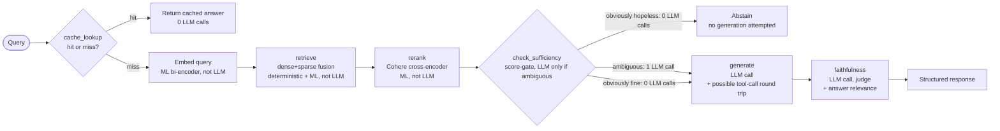
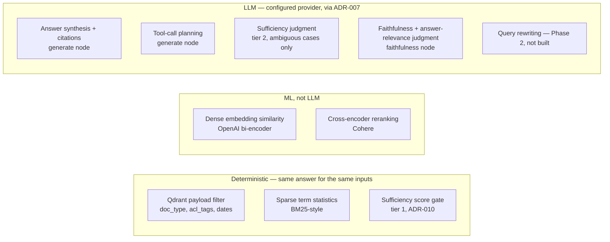

# AI Architecture — Grounded RAG over Wikipedia

See [README.md](../README.md) for the governing principle. See
[ARCHITECTURE.md](ARCHITECTURE.md) for the component diagram these calls sit
inside.

## Where AI earns its place

This is a learning project (per [PRD.md §1](PRD.md#1-summary)): the goal is
to demonstrate six RAG techniques deliberately, so "could this be done
without an LLM" isn't disqualifying the way it would be in a cost-minimizing
production system. The bar that still applies, narrower than "could a model
do this" but real regardless of motive: **an LLM call's output is always a
draft, a judgment, a decision, or a query — never a number or a score that a
deterministic computation or a non-generative ML model already produces
better.** Concretely: the API response's `confidence` field is the
faithfulness judge's *qualitative* judgment turned into a number, not a
calibrated statistic — worth being explicit about, since "confidence" reads
like a probability and isn't one.

| Call | What it outputs | Could it be done without an LLM? | Why it's used here |
|---|---|---|---|
| Generation (`generate` node, FR5) | A drafted answer with inline citations | No — synthesizing fluent, citation-constrained prose from retrieved chunks is exactly the unstructured-language job nothing deterministic does | Core to the technique being demonstrated |
| Tool-call planning (`generate` node, FR8) | A decision to call the retrieval tool again, and with what query | Partially — a fixed "always retrieve twice" rule could substitute, but judging whether the first pass was *sufficient* needs language understanding of the draft against the question | Is the pattern being practiced |
| Context sufficiency judgment (`check_sufficiency` node, tier 2 only, FR15) | A sufficient/insufficient verdict, confidence, and the specific missing aspects | Mostly — the tier-1 score gate (`ADR-010`) already handles the deterministic-ish extremes (obviously hopeless or obviously fine) without an LLM; only the genuinely ambiguous middle band, where judging whether a possibly multi-part question is *fully* covered by a set of chunks needs language understanding, reaches the LLM | The tiered design exists specifically to keep this an LLM call only where a deterministic score can't decide |
| Faithfulness judgment (`faithfulness` node, FR6, FR-5.4) | A grounding/coverage judgment, an answer-relevance judgment, a reason, and a confidence value | Partially — exact-string citation-*presence* is feasible deterministically (the hybrid approach deferred in [ADR-006](ADRs.md#adr-006)), but judging whether a cited chunk's *meaning* actually supports a specific claim, or whether the answer addresses the question, needs language understanding | Is the pattern being practiced; the deferred hybrid is the documented fallback if this proves unreliable |
| Dense embedding (ingestion + query-time) | A vector, not text | N/A — not an LLM call at all; a bi-encoder, classical ML | Powers FR2's dense leg ([ADR-002](ADRs.md#adr-002)) |
| Sparse vectorization | A sparse vector, not text | N/A — deterministic term-frequency statistics (BM25-style), no model involved | Powers FR2's sparse leg |
| Reranking (Cohere, FR4) | A relevance score per candidate, not text | N/A — a cross-encoder ranking model, not a generative LLM; never produces language | Powers FR4 ([ADR-003](ADRs.md#adr-003)) |
| Query rewriting (FR11, Phase 2 — designed for, not built) | A decontextualized/expanded/decomposed query | No — resolving referents and implicit context across a multi-hop question needs language understanding | Designed into the roadmap; out of MVP scope |

## Pipeline / funnel

There are now two funnels, not one. The cache lookup is the first: a hit
returns with **zero** LLM calls. A miss runs through two non-LLM scoring
stages (dense+sparse fusion, then Cohere rerank) before reaching
`check_sufficiency` — the second funnel (FR15; `ADR-010`). Its tier-1 score
gate resolves the obviously-hopeless and obviously-fine cases with **zero**
further LLM calls, short-circuiting straight to an abstained response on the
hopeless ones (skipping `generate`/`faithfulness` entirely) or straight to
`generate` on the clearly-fine ones. Only the genuinely ambiguous middle
band spends an LLM call on sufficiency itself.

This keeps LLM call volume bounded, not fixed: as low as **zero** (cache hit
or tier-1 insufficient), typically **two** (sufficient, generation +
faithfulness), occasionally **three** (ambiguous context, sufficiency +
generation + faithfulness — generation may itself add one extra *retrieval*
round trip via the bound tool, not a fourth LLM call).

## RAG / retrieval & grounding

- **Source:** the 1,000-article Wikipedia slice ([PRD.md
  §3](PRD.md#3-dataset)), chunked 5–15 chunks/doc, embedded with OpenAI
  `text-embedding-3-small` and sparse-vectorized, both stored per-chunk in
  Qdrant's `articles` collection ([DATA-MODEL.md](DATA-MODEL.md)).
- **Scoping:** hybrid dense+sparse fusion, with `doc_type`/`acl_tags`/date
  payload filtering applied *before* fusion, never after
  ([ADR-008](ADRs.md#adr-008)).
- **Grounding:** the `faithfulness` node checks each cited claim against the
  specific chunk it's attributed to. Citation *validity* (does `chunk_id`
  resolve to a chunk that was actually retrieved for this request) is
  enforced structurally by the response construction in
  [API-CONTRACTS.md](API-CONTRACTS.md); citation *support* (does that chunk
  actually back the claim) is the judge's call.
- **Citation:** every chunk's payload carries `doc_id`, `title`, `url`, and
  `chunk_id`, so a grounded answer traces back to an exact, externally
  verifiable Wikipedia source — see [DATA-MODEL.md](DATA-MODEL.md).

## Deterministic vs. ML vs. LLM split

| Computation | Mechanism |
|---|---|
| Exact metadata/ACL match | Deterministic — Qdrant payload filter |
| Sparse keyword relevance | Deterministic — BM25-style term statistics |
| Dense semantic similarity | ML, not LLM — OpenAI bi-encoder embedding, cosine/dot scoring |
| Candidate reranking | ML, not LLM — Cohere cross-encoder |
| Cache-cluster matching | ML, not LLM — embedding similarity, scoped by the `acl_signature` filter |
| Context sufficiency, tier 1 (obvious cases) | Deterministic — Cohere `relevance_score` threshold gate ([ADR-010](ADRs.md#adr-010)) |
| Answer synthesis + citations | LLM |
| Tool-call planning (whether/what to re-retrieve) | LLM |
| Context sufficiency, tier 2 (ambiguous cases) | LLM |
| Faithfulness judgment + answer relevance + confidence | LLM |
| Query rewriting / decomposition (Phase 2, not built) | LLM |

## Safety

- **Input trust:** `query` text and `access_context` are caller-supplied and,
  in a generic API sense, untrusted — but the MVP has no real adversarial
  multi-caller surface (it's exercised by its own builder). No
  prompt-injection defense is built beyond keeping retrieved chunks as
  labeled context rather than instructions in the generation prompt (see
  below); this would need revisiting before any exposure beyond local
  testing, per [PRD.md §2.3](PRD.md#23-non-goals-mvp)'s non-goals.
- **Ingestion trust:** the `wikimedia/wikipedia` `20231101.en` snapshot is a
  curated, point-in-time dump, not a live-edit feed — meaningfully more
  trustworthy than scraping live Wikipedia, but **not** guaranteed free of
  vandalism or low-quality edits that happened to be live at snapshot time.
  This is a real, low-probability prompt-injection-via-corpus surface
  (a chunk could in principle contain adversarial text), explicitly accepted
  for this build rather than mitigated with a content-sanitization pass
  beyond basic field-presence checks at ingestion.
- **Instruction/data separation:** retrieved chunks and tool results are
  passed to the model as clearly delimited context, never concatenated into
  the instruction portion of the prompt. If the `faithfulness` node's
  failure path ever feeds a correction instruction back into `generate`
  (mirroring a retry-loop pattern), that instruction is a fixed template,
  never free-form text carried forward from a prior model call.

## Governance & telemetry

- **Evaluation:** the labeled eval set (UC-1 through UC-8,
  [PRD.md §4.2](PRD.md#42-core-use-cases--illustrative-eval-set)) is run
  manually against the actual 1,000-article slice once M0 lands, and is also
  the basis for the vector-only vs. hybrid vs. hybrid+rerank comparison
  required by FR2/FR4's exit criteria.
- **Cost tracking:** every external API call (embedding, rerank, generation,
  judge) is metered on its own provider's dashboard; no internal
  cost-tracking system is built at MVP scale — FR13 (per-request
  observability) is P1, not MVP. Provider dashboards are sufficient at this
  call volume.
- **Per-tenant budgets:** not applicable — synthetic `acl_tags` groups
  aren't real tenants with separate billing relationships. A real permission
  system, were one ever integrated (the "tenant-aware caller" persona in
  [PRD.md §4](PRD.md#4-personas)), would need this revisited.
- **Auditability:** until FR13 lands, the only record of a request's
  retrieve/rerank/generate/faithfulness path is whatever's logged ad hoc
  during development — there is no per-request trace store in the MVP.
