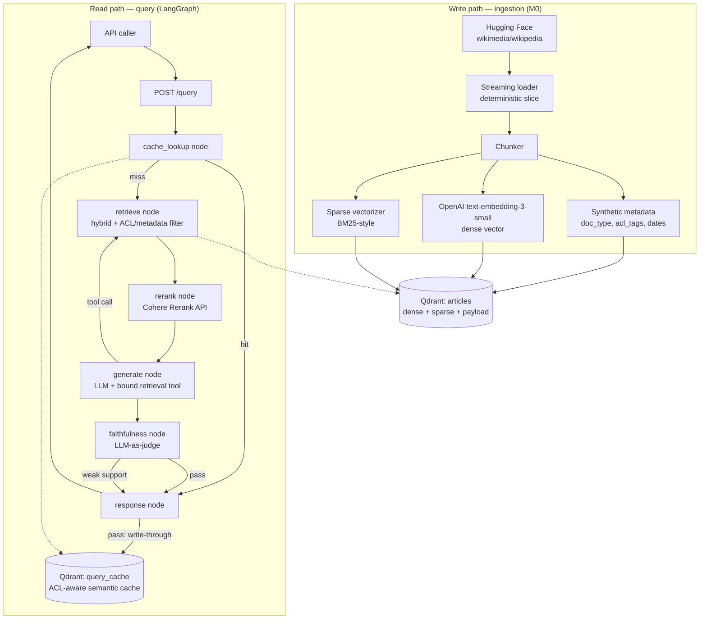
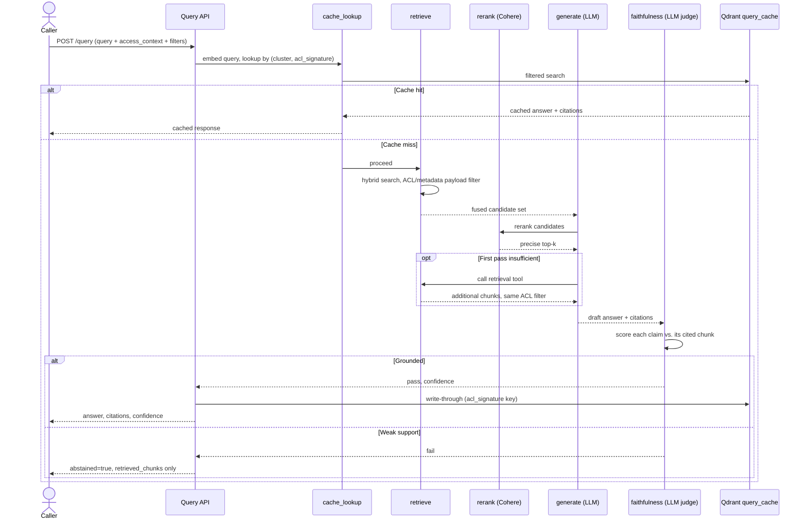
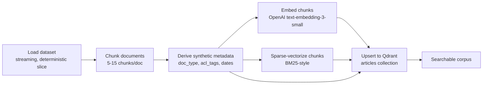

# Architecture — Grounded RAG over Wikipedia

See [README.md](../README.md) for the governing principle and locked stack.
See [ADRs.md](ADRs.md) for why each contested choice below won over its
alternatives.

## Design tenets

1. **Verifiable-or-abstain** (the governing principle) — every node that can
   produce or influence the final answer is downstream of, or routes into,
   the faithfulness gate (`faithfulness` node). Nothing — not the cache, not
   the retrieval tool, not a future query-rewrite or parallel-tool-call path
   — returns an answer that skipped it.
2. **ACL is structural, not a convention.** Permission filtering happens
   inside the retrieval query (`ADR-008`) and inside the cache key
   (`ADR-005`) — never as an afterthought filter applied to output after the
   fact.
3. **One hybrid engine, not two synced systems.** Qdrant alone serves dense +
   sparse retrieval *and* the semantic cache (as a second collection), so
   there's no cross-system consistency problem between a vector store and a
   separate keyword index, or between a search index and a separate cache
   store.
4. **No model hosting unless avoiding it costs more than running it.** Every
   model in the stack — embeddings, reranker, generation, faithfulness judge
   — is a hosted API call by default (`ADR-002`, `ADR-003`). Self-hosting is
   the documented fallback in each ADR, not the starting point.
5. **No LLM vendor lock-in.** The generation and faithfulness-judge models
   are selected by config (`ADR-007`), never imported as a hardcoded vendor
   SDK call inside node code.

## High-level architecture

## Tiers / components

| Component | Responsibility | Tech | Backs |
|---|---|---|---|
| Ingestion pipeline | Load HF dataset slice, chunk, derive synthetic metadata/ACL tags, embed (dense + sparse), upsert to Qdrant | Python batch script | FR1; [ADR-002](ADRs.md#adr-002), [ADR-004](ADRs.md#adr-004), [ADR-008](ADRs.md#adr-008) |
| Qdrant `articles` collection | Dense + sparse vector per chunk; payload carries `doc_type`/`acl_tags`/dates; one hybrid query does fusion + payload filter | Qdrant | FR2, FR3; [ADR-004](ADRs.md#adr-004), [ADR-008](ADRs.md#adr-008) |
| Qdrant `query_cache` collection | Semantic cache: query embedding → cached answer + citations; payload carries `acl_signature` and a write timestamp for TTL | Qdrant, second collection | FR9; [ADR-005](ADRs.md#adr-005) |
| `cache_lookup` node | Embeds the incoming query, searches `query_cache` filtered by `acl_signature`, returns hit/miss | LangGraph node | FR9 |
| `retrieve` node | Hybrid query against `articles`, filtered by ACL/metadata before fusion | LangGraph node | FR2, FR3 |
| Retrieval tool | The same hybrid+filter query as `retrieve`, exposed as a typed LangGraph tool the `generate` node can call mid-turn | LangGraph tool | FR8 |
| `rerank` node | Calls the Cohere Rerank API over the fused candidate set | LangGraph node + Cohere API | FR4; [ADR-003](ADRs.md#adr-003) |
| `generate` node | Calls the configured LLM with the top-k context, a citation-constrained prompt, and the retrieval tool bound | LangGraph node + configured LLM | FR5, FR8; [ADR-001](ADRs.md#adr-001), [ADR-007](ADRs.md#adr-007) |
| `faithfulness` node | LLM-as-judge scores each cited claim against its cited chunk; decides abstain | LangGraph node + configured LLM | FR6, FR7; [ADR-006](ADRs.md#adr-006) |
| `response` node | Formats the structured API response; writes through to `query_cache` only after a faithfulness pass | LangGraph node | FR7, FR9 |
| API layer | Accepts `POST /query`, runs the compiled graph, returns the structured response | HTTP service (Python) | [API-CONTRACTS.md](API-CONTRACTS.md) |

There is no intent router in this graph (unlike a multi-path agent design) —
every query takes the same cache → retrieve → rerank → generate →
faithfulness shape. The only branching is cache hit/miss, the `generate`
node's optional tool call back into `retrieve`, and the faithfulness
pass/fail split.

## Key flows

### Query flow

**Cache hit:** `cache_lookup` embeds the query, searches `query_cache`
filtered to the caller's `acl_signature`, and returns the cached answer
directly — `retrieve`, `rerank`, `generate`, and `faithfulness` never run.

**Cache miss, grounded:** `retrieve` → `rerank` → `generate` (optionally
calling the retrieval tool mid-turn) → `faithfulness` passes → `response`
writes through to `query_cache` and returns the answer.

**Cache miss, weak support:** same path, but `faithfulness` fails →
`response` returns `abstained: true` with the closest `retrieved_chunks` and
**does not** write through to the cache — an abstention is not a verified
answer and must not be served as a cache hit to a later, identical query.

### Ingestion flow

Chunk IDs are derived deterministically from `(doc_id, chunk_index)`, so
re-running ingestion **upserts**, never duplicates — see
[Cross-cutting](#cross-cutting).

## Multi-tenancy & isolation

There is no real tenant system. `access_context.groups` simulates one: every
chunk carries synthetic `acl_tags` derived deterministically at ingestion
(see [DATA-MODEL.md](DATA-MODEL.md#acl-tag-derivation)), and every read-path
request carries an `access_context` the caller asserts (not authenticates) —
this is a simulation of an access boundary for exercising the pre-filter and
cache-key machinery, not a real authorization system. Two structural
enforcement points, both pre-decided in ADRs:

- **Retrieval pre-filter** ([ADR-008](ADRs.md#adr-008)) — `acl_tags` are
  checked inside the Qdrant payload filter before fusion; a chunk outside
  the caller's groups never enters the candidate set.
- **Cache key** ([ADR-005](ADRs.md#adr-005)) — `acl_signature` is part of
  the `query_cache` key; a cached answer never crosses an `acl_signature`
  boundary.

The standing backstop test is UC-7
([PRD.md §4.2](PRD.md#42-core-use-cases--illustrative-eval-set)): the same
query text under two different `access_context` values must never collide on
a cache hit. This runs from M4 onward and must always pass.

A real permission system, if ever integrated, would replace how
`access_context` is populated (authenticated identity → real group
membership) without changing either enforcement point — both are already
written against an opaque list of group strings.

## Scale & capacity model

Full target numbers and the capacity math behind them are in
[REQUIREMENTS.md](REQUIREMENTS.md#capacity-sizing). How the design gets
there, component by component:

| Lever | Mechanism |
|---|---|
| Vector index size at 10M docs | Qdrant's built-in int8 quantization (~4x reduction), applied at Stage 2 of the roadmap |
| Query throughput | Qdrant shards across nodes (Stage 3); the LangGraph read path is stateless per request and scales horizontally behind a load balancer |
| Rerank/embedding/LLM call volume | Each is a hosted API call with its own provider-side scaling — not infrastructure this project operates, but a cost line that grows linearly with uncached query volume |
| The biggest lever: cache hit rate | A hit skips retrieval, rerank, *and* two LLM calls (generation + faithfulness) entirely. The ACL-aware key narrows hit rate ([ADR-005](ADRs.md#adr-005)) — the 40–60% planning assumption ([PRD.md §6.2](PRD.md#62-scale-targets-10m-documents-roadmap--design-exercise-not-a-build-target)) is unvalidated and the top operational risk |
| Index freshness at scale | Deferred to FR10 (P1) — a change-driven pipeline splitting cheap metadata-only updates from expensive re-embeds; not built in the MVP |

This is a design exercise proving the component boundaries hold across three
orders of magnitude ([PRD.md §10](PRD.md#10-roadmap-from-1k-to-10m)), not a
load-tested guarantee.

## Failure modes & degradation

| Tier | What breaks | What the system does |
|---|---|---|
| Qdrant unreachable (`articles`) | Retrieval query fails or times out | No candidate set means generation must not run with zero grounding context — short-circuit to an explicit error response, distinct from an `abstained` answer (abstain means "evidence was weak," not "the system failed") |
| Qdrant unreachable (`query_cache`) | Cache lookup or write-through fails | Treat as a cache miss and proceed through the full read path. Caching is a latency/cost optimization, never a correctness dependency — the read path must never block on cache availability |
| Cohere Rerank API down or rate-limited | `rerank` node call fails | Degrade to fusion-only ranking — pass the fused top-k straight to `generate` rather than failing the request (documented in [ADR-003](ADRs.md#adr-003)) |
| OpenAI embeddings API down | Can't embed the incoming query (or, at ingestion time, a document) | Query-time: fail the request — there is no retrieval without a query embedding, a hard dependency, not a degradable one. Ingestion-time: blocks that ingestion run only, not a live request |
| Configured LLM down/erroring — `generate` | Generation call fails | Bounded retry with backoff; on exhaustion, return an explicit error distinct from `abstained` |
| Configured LLM down/erroring — `faithfulness` | Judge call fails | Same bounded retry; on exhaustion, default to **abstain**, never to an unverified pass — consistent with the governing principle: never skip the gate, never assume a pass |
| Faithfulness judge is too lenient (passes an ungrounded answer) | An unverified answer is returned as if grounded | No runtime mitigation exists for this; it's why the eval set ([PRD.md §4.2](PRD.md#42-core-use-cases--illustrative-eval-set)) exists, and why [ADR-006](ADRs.md#adr-006) documents a deterministic+LLM hybrid as the next step if this proves common |

## Cross-cutting

- **Security:** corpus content is public, low-sensitivity (Wikipedia);
  `access_context` is a synthetic, self-asserted boundary, **not** a real
  authentication/authorization system — calling code must never treat
  passing ACL groups as proof of identity. API keys (OpenAI, Cohere,
  whichever LLM provider is configured per [ADR-007](ADRs.md#adr-007)) live
  in environment variables, never committed.
- **Idempotency:** ingestion upserts into Qdrant by a chunk ID deterministically
  derived from `(doc_id, chunk_index)`, so re-running ingestion never
  duplicates chunks.
- **Consistency:** single writer (the ingestion batch job) for `articles` at
  MVP scale — the read path is read-only against it. `query_cache` has many
  concurrent writers (every request that passes faithfulness), but each
  write targets a distinct `(semantic cluster, acl_signature)` point, so
  last-write-wins is sufficient; no transactional guarantee is needed.
- **Config/secrets:** environment variables hold `OPENAI_API_KEY`,
  `COHERE_API_KEY`, whichever provider key the configured generation/judge
  LLM needs, and `QDRANT_URL`/`QDRANT_API_KEY` (local instance for MVP,
  managed cluster at scale — [ADR-009](ADRs.md#adr-009)). Nothing
  provider-specific is hardcoded in node code.
