# Roadmap — Grounded RAG over Wikipedia

MVP-first phases (M0–M6), then the scale stages (1K → 10M) as a separate
design exercise. See [PRD.md §9](PRD.md#9-milestones) for the one-line
summary of each milestone; this doc carries the full ships/unlocks/verify
detail and the sequencing rationale.

## M0 — Ingestion and indexing (write path)

- [x] **M0 status: done** — merged to `main`, verified (`scripts/verify_m0.py`)

**Goal:** the walking skeleton — a queryable, ACL-filterable corpus, before
any read-path graph exists.

**Ships:**
- [x] Streaming loader for the deterministic 1,000-document slice (`wikimedia/wikipedia`, `20231101.en`)
- [x] Chunker (sentence-aware, ~500 tokens / 50 overlap — [DATA-MODEL.md](DATA-MODEL.md))
- [x] Synthetic `doc_type`, `acl_tags`, `created_at`/`updated_at` derivation (FR1.1)
- [x] Dense embedding (OpenAI `text-embedding-3-small`) + sparse vectorization (`fastembed`/`Qdrant/bm25`) per chunk
- [x] Upsert into Qdrant `articles` collection, with payload indexes on the filterable fields

**Unlocks:** every later phase depends on this corpus existing and being
filterable; nothing downstream can be tested without it.

**Verify:** query Qdrant's `articles` collection directly with a payload
filter (e.g. `doc_type=long AND acl_tags contains "public"`) and confirm
only matching chunks return (FR-1.1's acceptance criterion) — the cheapest
possible check that the data model and `ADR-008`'s pre-filter design will
actually work, before any retrieval ranking or LLM is involved.

## M1 — Hybrid retrieval plus filtering (FR2, FR3)

- [x] **M1 status: done** — merged to `main`, verified (`scripts/eval_m1.py`: UC-3 6/6 pass; UC-1 recall@5 hybrid=dense-only=100%, delta below the placeholder +10-point margin — see [REQUIREMENTS.md](REQUIREMENTS.md#open-assumptions))

**Goal:** prove the single-engine hybrid query (`ADR-004`) and the ACL
pre-filter on real queries, before adding rerank or generation on top.

**Ships:**
- [x] `retrieve` node: Qdrant hybrid query (dense + sparse fusion) with the metadata/ACL payload filter applied before fusion
- [x] Eval harness (`scripts/eval_m1.py`): runs the eval set's UC-1/UC-3 cases against the real corpus, computing Recall@k (hybrid vs. dense-only) and checking the ACL filter against the raw candidate set — the infrastructure this milestone's own exit criteria depend on, not just the `retrieve` node itself
- [x] The eval set's UC-1/UC-3 cases run against the real corpus for the first time

**Unlocks:** validates that `ADR-004`'s single-engine bet (Qdrant native
hybrid, instead of two synced stores) actually produces a sane fused
candidate set — the foundational retrieval risk flagged in that ADR.

**Verify:** UC-1 (single-hop factual) returns the correct article in the
top-k; UC-3 (ACL/metadata filter) excludes the filtered-out chunk from the
*candidate set itself*, not just the final answer; FR-2.3's recall@k
comparison (hybrid vs. dense-only) is measured for the first time.

## M2 — Reranking (FR4)

- [x] **M2 status: done** — merged to `main`, verified (`scripts/eval_m2.py`: FR-3.2 fallback PASS; UC-2 precision@3 rerank=77.8% vs. fusion-only=66.7%, delta +11.1 points, below the placeholder +15-point margin — see [REQUIREMENTS.md](REQUIREMENTS.md#open-assumptions))

**Goal:** add Cohere reranking over M1's candidate set, and measure whether
it earns its cost (`ADR-003`).

**Ships:**
- [x] `rerank` node: Cohere Rerank API call over the fused candidate set, returning a precise top-k
- [x] Fallback path: a Cohere failure degrades to fusion-only ranking (FR-3.2)

**Unlocks:** the precision improvement FR4 exists to demonstrate, and the
first real signal on whether `ADR-003`'s reranker choice (hosted API vs.
self-hosted) is justified by the quality delta observed.

**Verify:** UC-2 (ambiguous-candidate case) shows rerank's precision@k
beating fusion-only, measured against the eval set, not asserted by
inspection; a simulated Cohere failure (FR-3.2) still returns a usable,
fusion-ranked response.

## M3 — Grounded generation, citations, faithfulness, abstain, tool use (FR5, FR6, FR7, FR8)

- [x] **M3 status: done** — merged to `main`, verified (`scripts/eval_m3.py`: NFR-9 citation validity PASS, NFR-8 abstain correctness PASS, FR-4.2 tool-call bound PASS across repeated runs; UC-8 faithfulness pass rate 66.7%–100% across repeated runs — see [REQUIREMENTS.md](REQUIREMENTS.md#open-assumptions))

**Goal:** the centerpiece milestone — wires the LangGraph read path
end-to-end and proves the governing principle (verifiable-or-abstain) holds
on real queries.

**Ships:**
- [x] `generate` node: citation-constrained answer generation from the top-k, via the provider-agnostic LLM (`ADR-007`)
- [x] The retrieval tool (FR8), bound to `generate`, inheriting the original request's `access_context`/filters (FR-4.3)
- [x] `faithfulness` node: LLM-as-judge scoring (`ADR-006`), gating the abstain decision
- [x] `response` node: the full structured API response shape ([API-CONTRACTS.md](API-CONTRACTS.md))

**Unlocks:** the first end-to-end answer the project produces. Also the
first real test of `ADR-001`'s LangGraph bet — the retrieval-tool loop is
the first cycle in the graph to actually execute.

**Verify:** UC-8 (well-grounded case) passes faithfulness cleanly; UC-4
(multi-hop) triggers exactly one additional tool call with a refined query;
UC-5 (unanswerable) produces an explicit abstention, never a fabricated
answer — this is the milestone where the project's central claim
("grounded or abstain") either holds up or doesn't.

## M4 — Semantic caching, ACL-aware (FR9)

- [ ] **M4 status: not started**

**Goal:** add the cache, and prove the one property that can never regress:
no answer crosses an access boundary.

**Ships:**
- [ ] `cache_lookup` node and the `query_cache` Qdrant collection ([DATA-MODEL.md](DATA-MODEL.md))
- [ ] Write-through from `response`, gated on a faithfulness pass (FR-6.3) — an abstained answer is never cached (FR-5.3)
- [ ] `cache_hit` field surfaced in the API response ([API-CONTRACTS.md](API-CONTRACTS.md))

**Unlocks:** the cache hit rate measurement that everything in
[PRD.md §12](PRD.md#12-risks-and-open-questions) and
[REQUIREMENTS.md](REQUIREMENTS.md#capacity-sizing)'s LLM-call-volume math is
downstream of — this is the first point real numbers exist instead of a
40–60% planning assumption.

**Verify:** UC-6 (repeat query, same context) returns `cache_hit: true`;
UC-7 (same query, two different `access_context` values) **never** shares a
hit — this becomes a standing regression test from here on, run on every
later change to caching, retrieval, or the API contract.

## M5 — Phase 2 techniques (FR11, FR12)

- [ ] **M5 status: not started**

**Goal:** the two deferred techniques, added once the MVP's core loop
(M0–M4) is proven stable — deliberately last among the "designed for"
items because both extend the `generate` node's control flow, which is
easiest to get wrong if the simpler path beneath it isn't already trusted.

**Ships:**
- [ ] Query rewriting (FR11): decontextualize/expand/decompose before retrieval
- [ ] Parallel tool calls with partial-failure handling (FR12)

**Unlocks:** nothing inside the MVP depends on this — it's explicitly
designed-for/sequenced-in rather than required for the MVP to be considered
done (`PRD.md §2.3`).

**Verify:** acceptance criteria for FR-7.1/FR-7.2 are deferred to this
phase's own design pass, not pinned in advance (`REQUIREMENTS.md`) — writing
them now would invent detail this suite doesn't have yet.

## M6 — Observability and feedback (FR13, FR14)

- [ ] **M6 status: not started**

**Goal:** per-request traceability and an offline-eval feedback loop, added
last because nothing else's correctness depends on it.

**Ships:**
- [ ] Per-request trace spanning retrieve/rerank/generate/faithfulness (FR13)
- [ ] Feedback ingestion, thumbs up/down (FR14)

**Unlocks:** nothing further — this is the last MVP-adjacent milestone.

**Verify:** any request can be traced stage by stage; feedback is recorded
and retrievable for offline review.

## Sequencing rationale

```mermaid
flowchart LR
    M0["M0\nIngestion\nQdrant articles\nverify: payload filter"]
    M1["M1\nHybrid retrieval\nverify: UC-1, UC-3"]
    M2["M2\nReranking\nverify: UC-2"]
    M3["M3\nGeneration + faithfulness\n+ abstain + tool use\nverify: UC-4, UC-5, UC-8"]
    M4["M4\nACL-aware cache\nverify: UC-6, UC-7"]
    M5["M5\nQuery rewriting +\nparallel tool calls"]
    M6["M6\nObservability + feedback"]

    M0 -->|"corpus exists,\nfilterable"| M1
    M1 -->|"candidate set\nproven sane"| M2
    M2 -->|"precision gain\nmeasured"| M3
    M3 -->|"grounded-or-abstain\nholds end to end"| M4
    M4 -->|"cache safety proven,\nreal hit-rate data exists"| M5
    M5 --> M6
```

Each milestone retires one specific risk before the next one adds
complexity on top: M0 retires "does the data model actually filter
correctly," M1 retires "does the single-engine hybrid bet produce a sane
candidate set," M2 retires "does paying for rerank actually earn its keep,"
M3 retires the project's central claim, M4 retires the cache-safety
property that must never regress afterward, and M5/M6 are additive once
that foundation holds.

## Scale stages

A design exercise proving the architecture's component boundaries hold
across three orders of magnitude
([PRD.md §1](PRD.md#1-summary)) — not a build commitment.

| Stage | Corpus | What changes | What stays the same |
|---|---|---|---|
| MVP | 1K docs | Single Qdrant shard, no quantization; batch ingest; low QPS | All component interfaces |
| Stage 1 | 100K docs | Qdrant managed cloud or a dedicated self-hosted cluster instead of a local instance; verify hybrid fusion + rerank latency hold | Read path logic, API contract |
| Stage 2 | 1M docs | Int8 quantization on the dense vectors; tune candidate-set sizes; turn on the semantic cache under a realistic query mix to measure *real* hit rate for the first time | Component boundaries, faithfulness and abstain logic |
| Stage 3 | 10M docs | Shard the quantized index across nodes; replace batch ingestion with FR10's change-driven pipeline (cheap metadata-only updates split from expensive re-embeds); meet the full latency/throughput/availability targets in [REQUIREMENTS.md](REQUIREMENTS.md) | The same retrieve/rerank/generate/faithfulness/cache components |

Two scale-specific mechanisms, introduced only when justified:

- **Near-real-time ingestion (FR10)** — replaces batch at Stage 3, driven by
  a change-event stream, separating ACL/metadata-only updates (rewrite
  payload, skip re-embedding) from content changes (re-chunk and re-embed).
- **Alias-based deployment** — for whole-index rebuilds specifically
  (embedding-model or chunking-strategy upgrades, where every vector must be
  recomputed): build a new collection in the background, warm it, then
  atomically repoint the alias. Not used for routine incremental updates,
  which the live upsert path already handles.
